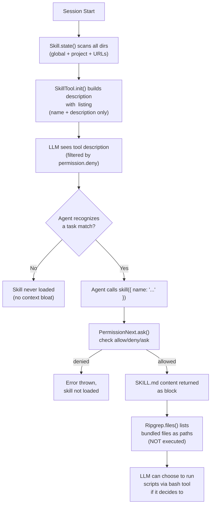
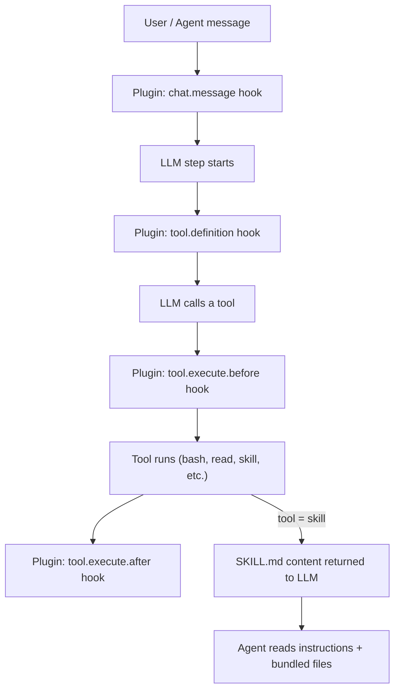

## OpenCode Skill System vs. Claude's Agent Framework Approach

### 1. Explicit Compatibility, Not Replacement

The most important framing point is that OpenCode's skill system is **intentionally designed to be compatible with Claude Code's directory conventions**, not opposed to them. The `EXTERNAL_DIRS` constant in `skill.ts` carries this comment directly in the code:

> "External skill directories to search for (project-level and global) — These follow the directory layout used by Claude Code and other agents." [1](#2-0) 

OpenCode scans `.claude/skills/` and `~/.claude/skills/` alongside its own `.opencode/skills/` as first-class skill locations. [2](#2-1) 

The `Flag` namespace even provides granular environment variables for users who want to disable this compatibility shim: [3](#2-2) 

And the `rules.mdx` documentation explicitly frames this as a migration path: [4](#2-3) 

---

### 2. The Core Architectural Difference: On-Demand via Tool Call vs. Auto-Injection

This is the central design divergence. OpenCode skills are **not** injected into the agent's system prompt or context at session startup. Instead, they are loaded **on-demand** when the agent explicitly calls the `skill` tool. The official documentation states this plainly: [5](#2-4) 

The `SkillTool` in `tool/skill.ts` implements this: at **description-generation time**, it only surfaces each skill's `name`, `description`, and `location` inside an `<available_skills>` XML block embedded in the tool's description — no full `SKILL.md` content is given to the LLM upfront. [6](#2-5) 

The tool's description itself explains the intended agent behavior:

> "When you recognize that a task matches one of the available skills listed below, use this tool to load the full skill instructions."
> "The skill will inject detailed instructions, workflows, and access to bundled resources (scripts, references, templates) into the conversation context." [7](#2-6) 

Full skill content (`SKILL.md` body) only enters the conversation **after** the agent calls `skill({ name: "..." })`, at which point it is returned as a `<skill_content>` block in the tool result. [8](#2-7) 

---

### 3. File Listing Without Script Execution

When a skill is loaded, `SkillTool.execute()` uses `Ripgrep.files()` to enumerate up to 10 non-`SKILL.md` files in the skill's directory (scripts, templates, references, etc.) and includes them as `<file>` paths inside a `<skill_files>` block: [9](#2-8) 

The tool output notes explicitly: `"Note: file list is sampled."` and `"Relative paths in this skill (e.g., scripts/, reference/) are relative to this base directory."` The files are **listed**, not executed. The LLM then decides whether to run them using other tools (like `bash`), preserving user control. [8](#2-7) 

---

### 4. Permission Gating — A Key Structural Difference

OpenCode layered an explicit permission system onto skill loading. Before any skill content enters the context, `ctx.ask()` is called with `permission: "skill"` and the skill name as pattern: [10](#2-9) 

This uses `PermissionNext.evaluate()` (last-match-wins, wildcard-based), which can be configured globally or per-agent in `opencode.json`: [11](#2-10) 

Permission filtering also happens **before** the tool description is shown to the LLM — skills with `deny` are hidden entirely: [12](#2-11) 

The documentation summarizes the three permission actions: [13](#2-12) 

Permissions can also be scoped per-agent (custom or built-in): [14](#2-13) 

Additionally, skill directories are automatically whitelisted in the `external_directory` permission, so the agent can read skill-bundled files without extra prompts: [15](#2-14) 

---

### 5. Skill Content is Declarative Markdown, Not Executable

OpenCode skills are pure YAML-frontmatter + Markdown, parsed via `ConfigMarkdown.parse()`: [16](#2-15) 

The schema enforced on load (and validated against the directory name) is: [17](#2-16) 

The documentation defines the frontmatter constraints explicitly: [18](#2-17) 

This is in deliberate contrast to a script-execution model — skills describe **what to do** in natural language instructions, not imperative code that runs automatically.

---

### 6. Remote Discovery Layer

OpenCode adds a remote discovery mechanism (`Discovery.pull()`) that Claude Code's local-only layout doesn't have. It fetches an `index.json` from a URL, downloads skill files to a local cache, and then processes them the same way as local skills: [19](#2-18) 

This is configured via `config.skills.urls` in `opencode.json`: [20](#2-19) 

---

### 7. Are There Formal Design Documents?

**No.** There is no dedicated design document or ADR in the repository that formally compares OpenCode's approach to Claude's agent framework or explains the philosophical rationale in prose. The closest sources of design intent in the codebase are:

- The **inline comment** in `skill.ts` acknowledging the Claude Code directory convention: [21](#2-20) 
- The **tool description text** in `tool/skill.ts`, which serves as the in-context explanation of the on-demand design (the tool tells the LLM *why* it should call the tool, implicitly encoding the design rationale): [22](#2-21) 
- The **rules documentation** framing Claude Code compatibility as a migration convenience: [4](#2-3) 
- The **`CONTRIBUTING.md`** policy that any core product feature must go through a design review, but no public output of those reviews is committed to the repo: [23](#2-22) 

---

### Summary Diagram



---

## Notes

- There is **no explicit written comparison** in the codebase between OpenCode's approach and Claude's agent framework's native skill model — the design intent is inferred from code comments, tool description text, flag names, and documentation framing.
- The rationale implicit in the code covers three main concerns: **context window efficiency** (on-demand avoids bloating every session), **user control** (permission gating before any content injection), and **agent selectivity** (the agent matches the right skill based on descriptions rather than having everything pre-loaded).
- OpenCode's support for `.claude/skills/` is treated as a **compatibility shim** controlled by feature flags, not a core design requirement — it can be fully disabled with `OPENCODE_DISABLE_EXTERNAL_SKILLS`.

### Citations

**File:** packages/opencode/src/skill/skill.ts (L19-25)
```typescript
  export const Info = z.object({
    name: z.string(),
    description: z.string(),
    location: z.string(),
    content: z.string(),
  })
  export type Info = z.infer<typeof Info>
```

**File:** packages/opencode/src/skill/skill.ts (L45-49)
```typescript
  // External skill directories to search for (project-level and global)
  // These follow the directory layout used by Claude Code and other agents.
  const EXTERNAL_DIRS = [".claude", ".agents"]
  const EXTERNAL_SKILL_PATTERN = "skills/**/SKILL.md"
  const OPENCODE_SKILL_PATTERN = "{skill,skills}/**/SKILL.md"
```

**File:** packages/opencode/src/skill/skill.ts (L56-88)
```typescript
    const addSkill = async (match: string) => {
      const md = await ConfigMarkdown.parse(match).catch((err) => {
        const message = ConfigMarkdown.FrontmatterError.isInstance(err)
          ? err.data.message
          : `Failed to parse skill ${match}`
        Bus.publish(Session.Event.Error, { error: new NamedError.Unknown({ message }).toObject() })
        log.error("failed to load skill", { skill: match, err })
        return undefined
      })

      if (!md) return

      const parsed = Info.pick({ name: true, description: true }).safeParse(md.data)
      if (!parsed.success) return

      // Warn on duplicate skill names
      if (skills[parsed.data.name]) {
        log.warn("duplicate skill name", {
          name: parsed.data.name,
          existing: skills[parsed.data.name].location,
          duplicate: match,
        })
      }

      dirs.add(path.dirname(match))

      skills[parsed.data.name] = {
        name: parsed.data.name,
        description: parsed.data.description,
        location: match,
        content: md.content,
      }
    }
```

**File:** packages/opencode/src/skill/skill.ts (L155-170)
```typescript
    // Download and load skills from URLs
    for (const url of config.skills?.urls ?? []) {
      const list = await Discovery.pull(url)
      for (const dir of list) {
        dirs.add(dir)
        const matches = await Glob.scan(SKILL_PATTERN, {
          cwd: dir,
          absolute: true,
          include: "file",
          symlink: true,
        })
        for (const match of matches) {
          await addSkill(match)
        }
      }
    }
```

**File:** packages/web/src/content/docs/skills.mdx (L6-7)
```text
Agent skills let OpenCode discover reusable instructions from your repo or home directory.
Skills are loaded on-demand via the native `skill` tool—agents see available skills and can load the full content when needed.
```

**File:** packages/web/src/content/docs/skills.mdx (L16-22)
```text
- Project config: `.opencode/skills/<name>/SKILL.md`
- Global config: `~/.config/opencode/skills/<name>/SKILL.md`
- Project Claude-compatible: `.claude/skills/<name>/SKILL.md`
- Global Claude-compatible: `~/.claude/skills/<name>/SKILL.md`
- Project agent-compatible: `.agents/skills/<name>/SKILL.md`
- Global agent-compatible: `~/.agents/skills/<name>/SKILL.md`

```

**File:** packages/web/src/content/docs/skills.mdx (L36-63)
```text
Each `SKILL.md` must start with YAML frontmatter.
Only these fields are recognized:

- `name` (required)
- `description` (required)
- `license` (optional)
- `compatibility` (optional)
- `metadata` (optional, string-to-string map)

Unknown frontmatter fields are ignored.

---

## Validate names

`name` must:

- Be 1–64 characters
- Be lowercase alphanumeric with single hyphen separators
- Not start or end with `-`
- Not contain consecutive `--`
- Match the directory name that contains `SKILL.md`

Equivalent regex:

```text
^[a-z0-9]+(-[a-z0-9]+)*$
```
```

**File:** packages/web/src/content/docs/skills.mdx (L126-148)
```text

Control which skills agents can access using pattern-based permissions in `opencode.json`:

```json
{
  "permission": {
    "skill": {
      "*": "allow",
      "pr-review": "allow",
      "internal-*": "deny",
      "experimental-*": "ask"
    }
  }
}
```

| Permission | Behavior                                  |
| ---------- | ----------------------------------------- |
| `allow`    | Skill loads immediately                   |
| `deny`     | Skill hidden from agent, access rejected  |
| `ask`      | User prompted for approval before loading |

Patterns support wildcards: `internal-*` matches `internal-docs`, `internal-tools`, etc.
```

**File:** packages/web/src/content/docs/skills.mdx (L152-209)
```text
## Override per agent

Give specific agents different permissions than the global defaults.

**For custom agents** (in agent frontmatter):

```yaml
---
permission:
  skill:
    "documents-*": "allow"
---
```

**For built-in agents** (in `opencode.json`):

```json
{
  "agent": {
    "plan": {
      "permission": {
        "skill": {
          "internal-*": "allow"
        }
      }
    }
  }
}
```

---

## Disable the skill tool

Completely disable skills for agents that shouldn't use them:

**For custom agents**:

```yaml
---
tools:
  skill: false
---
```

**For built-in agents**:

```json
{
  "agent": {
    "plan": {
      "tools": {
        "skill": false
      }
    }
  }
}
```
```

**File:** packages/opencode/src/flag/flag.ts (L22-28)
```typescript
  export const OPENCODE_DISABLE_CLAUDE_CODE = truthy("OPENCODE_DISABLE_CLAUDE_CODE")
  export const OPENCODE_DISABLE_CLAUDE_CODE_PROMPT =
    OPENCODE_DISABLE_CLAUDE_CODE || truthy("OPENCODE_DISABLE_CLAUDE_CODE_PROMPT")
  export const OPENCODE_DISABLE_CLAUDE_CODE_SKILLS =
    OPENCODE_DISABLE_CLAUDE_CODE || truthy("OPENCODE_DISABLE_CLAUDE_CODE_SKILLS")
  export const OPENCODE_DISABLE_EXTERNAL_SKILLS =
    OPENCODE_DISABLE_CLAUDE_CODE_SKILLS || truthy("OPENCODE_DISABLE_EXTERNAL_SKILLS")
```

**File:** packages/web/src/content/docs/rules.mdx (L69-83)
```text
### Claude Code Compatibility

For users migrating from Claude Code, OpenCode supports Claude Code's file conventions as fallbacks:

- **Project rules**: `CLAUDE.md` in your project directory (used if no `AGENTS.md` exists)
- **Global rules**: `~/.claude/CLAUDE.md` (used if no `~/.config/opencode/AGENTS.md` exists)
- **Skills**: `~/.claude/skills/` — see [Agent Skills](/docs/skills/) for details

To disable Claude Code compatibility, set one of these environment variables:

```bash
export OPENCODE_DISABLE_CLAUDE_CODE=1        # Disable all .claude support
export OPENCODE_DISABLE_CLAUDE_CODE_PROMPT=1 # Disable only ~/.claude/CLAUDE.md
export OPENCODE_DISABLE_CLAUDE_CODE_SKILLS=1 # Disable only .claude/skills
```
```

**File:** packages/opencode/src/tool/skill.ts (L13-20)
```typescript
  // Filter skills by agent permissions if agent provided
  const agent = ctx?.agent
  const accessibleSkills = agent
    ? skills.filter((skill) => {
        const rule = PermissionNext.evaluate("skill", skill.name, agent.permission)
        return rule.action !== "deny"
      })
    : skills
```

**File:** packages/opencode/src/tool/skill.ts (L22-46)
```typescript
  const description =
    accessibleSkills.length === 0
      ? "Load a specialized skill that provides domain-specific instructions and workflows. No skills are currently available."
      : [
          "Load a specialized skill that provides domain-specific instructions and workflows.",
          "",
          "When you recognize that a task matches one of the available skills listed below, use this tool to load the full skill instructions.",
          "",
          "The skill will inject detailed instructions, workflows, and access to bundled resources (scripts, references, templates) into the conversation context.",
          "",
          'Tool output includes a `<skill_content name="...">` block with the loaded content.',
          "",
          "The following skills provide specialized sets of instructions for particular tasks",
          "Invoke this tool to load a skill when a task matches one of the available skills listed below:",
          "",
          "<available_skills>",
          ...accessibleSkills.flatMap((skill) => [
            `  <skill>`,
            `    <name>${skill.name}</name>`,
            `    <description>${skill.description}</description>`,
            `    <location>${pathToFileURL(skill.location).href}</location>`,
            `  </skill>`,
          ]),
          "</available_skills>",
        ].join("\n")
```

**File:** packages/opencode/src/tool/skill.ts (L61-74)
```typescript
    async execute(params: z.infer<typeof parameters>, ctx) {
      const skill = await Skill.get(params.name)

      if (!skill) {
        const available = await Skill.all().then((x) => Object.keys(x).join(", "))
        throw new Error(`Skill "${params.name}" not found. Available skills: ${available || "none"}`)
      }

      await ctx.ask({
        permission: "skill",
        patterns: [params.name],
        always: [params.name],
        metadata: {},
      })
```

**File:** packages/opencode/src/tool/skill.ts (L76-97)
```typescript
      const dir = path.dirname(skill.location)
      const base = pathToFileURL(dir).href

      const limit = 10
      const files = await iife(async () => {
        const arr = []
        for await (const file of Ripgrep.files({
          cwd: dir,
          follow: false,
          hidden: true,
          signal: ctx.abort,
        })) {
          if (file.includes("SKILL.md")) {
            continue
          }
          arr.push(path.resolve(dir, file))
          if (arr.length >= limit) {
            break
          }
        }
        return arr
      }).then((f) => f.map((file) => `<file>${file}</file>`).join("\n"))
```

**File:** packages/opencode/src/tool/skill.ts (L99-121)
```typescript
      return {
        title: `Loaded skill: ${skill.name}`,
        output: [
          `<skill_content name="${skill.name}">`,
          `# Skill: ${skill.name}`,
          "",
          skill.content.trim(),
          "",
          `Base directory for this skill: ${base}`,
          "Relative paths in this skill (e.g., scripts/, reference/) are relative to this base directory.",
          "Note: file list is sampled.",
          "",
          "<skill_files>",
          files,
          "</skill_files>",
          "</skill_content>",
        ].join("\n"),
        metadata: {
          name: skill.name,
          dir,
        },
      }
    },
```

**File:** packages/opencode/src/permission/next.ts (L236-243)
```typescript
  export function evaluate(permission: string, pattern: string, ...rulesets: Ruleset[]): Rule {
    const merged = merge(...rulesets)
    log.info("evaluate", { permission, pattern, ruleset: merged })
    const match = merged.findLast(
      (rule) => Wildcard.match(permission, rule.permission) && Wildcard.match(pattern, rule.pattern),
    )
    return match ?? { action: "ask", permission, pattern: "*" }
  }
```

**File:** packages/opencode/src/agent/agent.ts (L54-55)
```typescript
    const skillDirs = await Skill.dirs()
    const whitelistedDirs = [Truncate.GLOB, ...skillDirs.map((dir) => path.join(dir, "*"))]
```

**File:** packages/opencode/src/skill/discovery.ts (L39-97)
```typescript
  export async function pull(url: string): Promise<string[]> {
    const result: string[] = []
    const base = url.endsWith("/") ? url : `${url}/`
    const index = new URL("index.json", base).href
    const cache = dir()
    const host = base.slice(0, -1)

    log.info("fetching index", { url: index })
    const data = await fetch(index)
      .then(async (response) => {
        if (!response.ok) {
          log.error("failed to fetch index", { url: index, status: response.status })
          return undefined
        }
        return response
          .json()
          .then((json) => json as Index)
          .catch((err) => {
            log.error("failed to parse index", { url: index, err })
            return undefined
          })
      })
      .catch((err) => {
        log.error("failed to fetch index", { url: index, err })
        return undefined
      })

    if (!data?.skills || !Array.isArray(data.skills)) {
      log.warn("invalid index format", { url: index })
      return result
    }

    const list = data.skills.filter((skill) => {
      if (!skill?.name || !Array.isArray(skill.files)) {
        log.warn("invalid skill entry", { url: index, skill })
        return false
      }
      return true
    })

    await Promise.all(
      list.map(async (skill) => {
        const root = path.join(cache, skill.name)
        await Promise.all(
          skill.files.map(async (file) => {
            const link = new URL(file, `${host}/${skill.name}/`).href
            const dest = path.join(root, file)
            await mkdir(path.dirname(dest), { recursive: true })
            await get(link, dest)
          }),
        )

        const md = path.join(root, "SKILL.md")
        if (await Filesystem.exists(md)) result.push(root)
      }),
    )

    return result
  }
```

**File:** CONTRIBUTING.md (L13-13)
```markdown
However, any UI or core product feature must go through a design review with the core team before implementation.
```


# OpenCode Plugins vs. Skills — Architecture, Hooks, and Claude Skill Migration

## Overview: The Conceptual Divide

OpenCode draws a sharp architectural boundary between **plugins** and **skills**:

| Concept | Purpose | Format | Execution |
|---|---|---|---|
| **Plugin** | Programmatic extension of OpenCode's runtime behavior | JS/TS module exported from npm or local file | Runs at startup; hooks called during the agent loop |
| **Skill** | Reusable, domain-specific *instructions* for the agent | Markdown (`SKILL.md`) with YAML frontmatter | Loaded on-demand by the agent via the `skill` tool |

Skills are purely **declarative** — they provide text instructions and bundled reference files to the AI. Plugins are purely **programmatic** — they intercept and mutate events in OpenCode's runtime.

---

## How Plugins Work

### Loading Mechanism

A plugin is a JS/TS module that exports one or more functions matching the `Plugin` type signature: an async function that receives a `PluginInput` context and returns a `Hooks` object. [1](#3-0) 

The runtime loading happens in `packages/opencode/src/plugin/index.ts`. On startup, OpenCode:

1. Loads **built-in internal plugins** (e.g., `CodexAuthPlugin`, `CopilotAuthPlugin`, `GitlabAuthPlugin`) directly: [2](#3-1) 

2. Then loads **npm plugins** listed in `opencode.json` under `"plugin"`, auto-installing them via Bun if needed: [3](#3-2) 

3. Also auto-discovers **local file plugins** from `{plugin,plugins}/*.{ts,js}` inside any `.opencode/` config directory: [4](#3-3) 

4. On `Plugin.init()`, each plugin's optional `config` hook is called with the full config, and the plugin is subscribed to all bus events via `Bus.subscribeAll`: [5](#3-4) 

Each plugin receives a `PluginInput` containing the opencode SDK `client`, the `project`, `directory`, `worktree`, a `serverUrl`, and Bun's `$` shell API: [6](#3-5) 

---

### The `Plugin.trigger` Dispatch Mechanism

All hooks (except `auth`, `event`, and `tool`) are dispatched via `Plugin.trigger`. It iterates all registered plugin hooks, calling the matching handler with a **read-only `input`** and a **mutable `output`**. Plugins mutate `output` in place; the final `output` is returned: [7](#3-6) 

---

### Complete `Hooks` Interface — All Extensibility Points

The full set of hooks a plugin can implement is defined in `packages/plugin/src/index.ts`: [8](#3-7) 

Here is a summary of every hook and when it fires:

#### Lifecycle & Configuration
- **`config`**: Called at init with the merged `Config` object. Plugins can read (not mutate) config here.
- **`event`**: Receives every event published to the `Bus` (session, message, file, permission, etc.).

#### LLM Call Interception
- **`chat.message`**: Fires after a user message is assembled. Plugins can mutate the message and its parts. [9](#3-8) 
- **`chat.params`**: Fires before an LLM API call. Plugins can modify `temperature`, `topP`, `topK`, and provider-specific `options`. [10](#3-9) 
- **`chat.headers`**: Fires before an LLM API call. Plugins can inject custom HTTP headers. [11](#3-10) 
- **`experimental.chat.messages.transform`**: Fires with the full message history just before each LLM step; plugins can mutate messages. [12](#3-11) 
- **`experimental.chat.system.transform`**: Fires with the system prompt array; plugins can inject or replace system prompt sections. [13](#3-12) 
- **`experimental.text.complete`**: Called after text generation completes.

#### Tool Interception
- **`tool.execute.before`**: Fires before every tool call (built-in, plugin, and MCP). Plugins can mutate `output.args` (i.e., the arguments the LLM sent to the tool). [14](#3-13) 
- **`tool.execute.after`**: Fires after every tool call. Plugins can mutate the result. [15](#3-14) 
- **`tool.definition`**: Fires when tools are resolved for each LLM step. Plugins can mutate the description and parameter schema sent to the LLM. [16](#3-15) 

#### Shell / Environment
- **`shell.env`**: Fires before any shell subprocess is spawned (bash tool, command `!` execution, PTY). Plugins inject into `output.env`. [17](#3-16) [18](#3-17) 

#### Permissions
- **`permission.ask`**: Fires when a tool requests a permission check. Plugins can auto-allow (`"allow"`) or auto-deny (`"deny"`) bypassing the user prompt. [19](#3-18) 

#### Commands
- **`command.execute.before`**: Fires before a slash-command is dispatched. Plugins can mutate the outgoing `parts`. [20](#3-19) 

#### Session Compaction
- **`experimental.session.compacting`**: Fires before the LLM generates a compaction summary. Plugins can inject `context` strings or replace the `prompt` entirely. [21](#3-20) 

#### Auth
- **`auth`**: Plugins declare an `AuthHook` to register OAuth/API-key auth flows for a specific provider. [22](#3-21) 

#### Custom Tools (via the `tool` key)
Plugins can register new LLM-callable tools under the `tool` key of the returned `Hooks` object, using the `tool()` helper: [23](#3-22) 

These are picked up by `ToolRegistry` and merged into the tool list for every LLM step: [24](#3-23) 

---

## How Skills Work

### Discovery

Skills are `SKILL.md` files discovered at startup. OpenCode scans all of these locations (in priority order, project-level overwriting global): [25](#3-24) 

- `.opencode/skills/<name>/SKILL.md` and `skills/<name>/SKILL.md` (native)
- `.claude/skills/<name>/SKILL.md` and `.agents/skills/<name>/SKILL.md` (Claude Code / agent compatibility)
- Global equivalents under `~/.config/opencode/` and `~/.claude/`, `~/.agents/`
- Additional paths from `config.skills.paths`
- Remote URLs served as an `index.json` catalog via `config.skills.urls` [26](#3-25) 

### The `SKILL.md` Format

Every `SKILL.md` must have YAML frontmatter with `name` (required) and `description` (required). The `name` must match the containing directory and follow the pattern `^[a-z0-9]+(-[a-z0-9]+)*$`. Other optional frontmatter: `license`, `compatibility`, `metadata`. The body is pure Markdown passed verbatim to the agent. [27](#3-26) 

### How Skills Are Exposed to the Agent

Skills are **not injected into every prompt**. Instead, they are surfaced via the built-in `skill` tool (`SkillTool`). At each LLM step, the tool description lists all available skills by name and description. The agent autonomously calls `skill({ name: "..." })` when it recognizes a task match. [28](#3-27) 

When the tool executes, it returns the skill's markdown content **plus a list of up to 10 bundled files** in the skill's directory (scripts, templates, references) as a `<skill_content>` block the agent can then act on: [29](#3-28) 

Skills are also registered as slash-commands, allowing users to invoke them directly from the UI: [30](#3-29) 

### Permissions

Access to individual skills (or patterns like `internal-*`) can be `allow`, `deny`, or `ask` via the `permission.skill` config key. This filtering happens at tool-description time so denied skills are invisible to the agent: [31](#3-30) 

---

## Key Differences: Plugins vs. Skills



| Dimension | Plugin | Skill |
|---|---|---|
| **Code execution** | Yes, arbitrary JS/TS at hook time | No — skills only provide Markdown text |
| **Shell scripts** | Via `shell.env` or `tool.execute.before`/`after` or a custom tool | Only described in SKILL.md; agent calls `BashTool` to run them |
| **Lifecycle hooks** | 12+ typed hooks covering the full agent loop | None — stateless text |
| **Distribution** | npm package or local `.ts`/`.js` file | Directory with `SKILL.md` + optional bundled files |
| **Scope** | Runtime behavior mutation | Agent instruction augmentation |
| **Claude compat** | N/A | `.claude/skills/` is auto-scanned as a fallback |

---

## Migrating a Claude Code Skill with Executable Scripts and Custom Hooks

### Step 1: Migrate the Declarative SKILL.md (zero change needed)

If your Claude skill already lives under `.claude/skills/<name>/SKILL.md`, OpenCode will discover it automatically without any changes, because `.claude/` is in the `EXTERNAL_DIRS` scan list: [32](#3-31) 

The preferred native location is `.opencode/skills/<name>/SKILL.md`. The markdown body and your bundled files (scripts, templates) carry over as-is. The `name` and `description` frontmatter fields are the only required ones in OpenCode.

### Step 2: Migrate Executable Scripts

Claude Code skills can bundle shell scripts that the agent is instructed to execute. In OpenCode, this pattern works identically: the `SkillTool` returns the **base directory** and a sampled **file list** alongside the skill content, so the agent can reference and call `bash` on those scripts directly: [33](#3-32) 

Your `SKILL.md` body should reference scripts by their relative path from the skill directory, e.g., `scripts/run.sh`. The agent can call the `bash` tool with the absolute path given in the `<skill_files>` block.

### Step 3: Migrate Custom Hooks to Plugins

This is the critical migration step. Claude Code skills have no equivalent to OpenCode's plugin hook system — **any behavior that goes beyond text instructions must be moved into a plugin**.

| Claude Code hook concept | OpenCode plugin hook |
|---|---|
| Pre/post tool execution | `tool.execute.before` / `tool.execute.after` |
| Injecting env vars for shell | `shell.env` |
| Filtering/modifying LLM input | `chat.message`, `chat.params`, `experimental.chat.system.transform` |
| Blocking/auto-approving actions | `permission.ask` |
| Observing events | `event` (receives all bus events) |
| Custom LLM-callable tools | `tool` key in the returned `Hooks` object |
| Command pre-processing | `command.execute.before` |

Create a plugin at `.opencode/plugins/my-skill-hooks.ts` (project-level) or `~/.config/opencode/plugins/my-skill-hooks.ts` (global). The plugin function receives the `BunShell` `$` API so it can run shell commands directly: [6](#3-5) [34](#3-33) 

The example plugin structure is: [35](#3-34) 

For TypeScript type safety, import the `Plugin` type from `@opencode-ai/plugin`. OpenCode will auto-install the `@opencode-ai/plugin` dependency into any `.opencode/package.json` on startup: [36](#3-35) 

### Step 4: (Optional) Remote Skill Distribution

If your Claude skill was shared across teams via a repository, OpenCode supports a URL-based pull model via `config.skills.urls`. The remote server must serve an `index.json` catalog, and individual skill files are cached locally: [37](#3-36) 

---

## Notes

- **`SKILL.md` is not executed**: It is pure Markdown fetched by the agent on demand. There is no concept of a "skill hook" in OpenCode — hooks are exclusively a plugin primitive.
- **The `!`\`cmd\`` syntax in commands/skills**: OpenCode's `ConfigMarkdown.shell()` regex (`/!`([^`]+)`/g`) supports inline shell execution in command templates, but **not** in `SKILL.md` files directly — that expansion happens in the command runner, not the skill loader. [38](#3-37) 
- **Tool name collisions**: If a plugin registers a tool with the same name as a built-in, the plugin tool wins. This can be used to override built-in tool behavior. [39](#3-38) 
- **Deduplication**: If the same npm plugin is listed in both global and project config, OpenCode deduplicates by canonical package name, keeping the higher-priority (project-level) version: [40](#3-39) 
- **`OPENCODE_DISABLE_EXTERNAL_SKILLS`**: Setting this flag disables the `.claude/` and `.agents/` compatibility scan, useful after completing a migration to the native `.opencode/skills/` path. [41](#3-40)

### Citations

**File:** packages/plugin/src/index.ts (L26-35)
```typescript
export type PluginInput = {
  client: ReturnType<typeof createOpencodeClient>
  project: Project
  directory: string
  worktree: string
  serverUrl: URL
  $: BunShell
}

export type Plugin = (input: PluginInput) => Promise<Hooks>
```

**File:** packages/plugin/src/index.ts (L37-103)
```typescript
export type AuthHook = {
  provider: string
  loader?: (auth: () => Promise<Auth>, provider: Provider) => Promise<Record<string, any>>
  methods: (
    | {
        type: "oauth"
        label: string
        prompts?: Array<
          | {
              type: "text"
              key: string
              message: string
              placeholder?: string
              validate?: (value: string) => string | undefined
              condition?: (inputs: Record<string, string>) => boolean
            }
          | {
              type: "select"
              key: string
              message: string
              options: Array<{
                label: string
                value: string
                hint?: string
              }>
              condition?: (inputs: Record<string, string>) => boolean
            }
        >
        authorize(inputs?: Record<string, string>): Promise<AuthOuathResult>
      }
    | {
        type: "api"
        label: string
        prompts?: Array<
          | {
              type: "text"
              key: string
              message: string
              placeholder?: string
              validate?: (value: string) => string | undefined
              condition?: (inputs: Record<string, string>) => boolean
            }
          | {
              type: "select"
              key: string
              message: string
              options: Array<{
                label: string
                value: string
                hint?: string
              }>
              condition?: (inputs: Record<string, string>) => boolean
            }
        >
        authorize?(inputs?: Record<string, string>): Promise<
          | {
              type: "success"
              key: string
              provider?: string
            }
          | {
              type: "failed"
            }
        >
      }
  )[]
}
```

**File:** packages/plugin/src/index.ts (L148-234)
```typescript
export interface Hooks {
  event?: (input: { event: Event }) => Promise<void>
  config?: (input: Config) => Promise<void>
  tool?: {
    [key: string]: ToolDefinition
  }
  auth?: AuthHook
  /**
   * Called when a new message is received
   */
  "chat.message"?: (
    input: {
      sessionID: string
      agent?: string
      model?: { providerID: string; modelID: string }
      messageID?: string
      variant?: string
    },
    output: { message: UserMessage; parts: Part[] },
  ) => Promise<void>
  /**
   * Modify parameters sent to LLM
   */
  "chat.params"?: (
    input: { sessionID: string; agent: string; model: Model; provider: ProviderContext; message: UserMessage },
    output: { temperature: number; topP: number; topK: number; options: Record<string, any> },
  ) => Promise<void>
  "chat.headers"?: (
    input: { sessionID: string; agent: string; model: Model; provider: ProviderContext; message: UserMessage },
    output: { headers: Record<string, string> },
  ) => Promise<void>
  "permission.ask"?: (input: Permission, output: { status: "ask" | "deny" | "allow" }) => Promise<void>
  "command.execute.before"?: (
    input: { command: string; sessionID: string; arguments: string },
    output: { parts: Part[] },
  ) => Promise<void>
  "tool.execute.before"?: (
    input: { tool: string; sessionID: string; callID: string },
    output: { args: any },
  ) => Promise<void>
  "shell.env"?: (
    input: { cwd: string; sessionID?: string; callID?: string },
    output: { env: Record<string, string> },
  ) => Promise<void>
  "tool.execute.after"?: (
    input: { tool: string; sessionID: string; callID: string; args: any },
    output: {
      title: string
      output: string
      metadata: any
    },
  ) => Promise<void>
  "experimental.chat.messages.transform"?: (
    input: {},
    output: {
      messages: {
        info: Message
        parts: Part[]
      }[]
    },
  ) => Promise<void>
  "experimental.chat.system.transform"?: (
    input: { sessionID?: string; model: Model },
    output: {
      system: string[]
    },
  ) => Promise<void>
  /**
   * Called before session compaction starts. Allows plugins to customize
   * the compaction prompt.
   *
   * - `context`: Additional context strings appended to the default prompt
   * - `prompt`: If set, replaces the default compaction prompt entirely
   */
  "experimental.session.compacting"?: (
    input: { sessionID: string },
    output: { context: string[]; prompt?: string },
  ) => Promise<void>
  "experimental.text.complete"?: (
    input: { sessionID: string; messageID: string; partID: string },
    output: { text: string },
  ) => Promise<void>
  /**
   * Modify tool definitions (description and parameters) sent to LLM
   */
  "tool.definition"?: (input: { toolID: string }, output: { description: string; parameters: any }) => Promise<void>
}
```

**File:** packages/opencode/src/plugin/index.ts (L19-48)
```typescript
  const BUILTIN = ["opencode-anthropic-auth@0.0.13"]

  // Built-in plugins that are directly imported (not installed from npm)
  const INTERNAL_PLUGINS: PluginInstance[] = [CodexAuthPlugin, CopilotAuthPlugin, GitlabAuthPlugin]

  const state = Instance.state(async () => {
    const client = createOpencodeClient({
      baseUrl: "http://localhost:4096",
      directory: Instance.directory,
      // @ts-ignore - fetch type incompatibility
      fetch: async (...args) => Server.App().fetch(...args),
    })
    const config = await Config.get()
    const hooks: Hooks[] = []
    const input: PluginInput = {
      client,
      project: Instance.project,
      worktree: Instance.worktree,
      directory: Instance.directory,
      serverUrl: Server.url(),
      $: Bun.$,
    }

    for (const plugin of INTERNAL_PLUGINS) {
      log.info("loading internal plugin", { name: plugin.name })
      const init = await plugin(input).catch((err) => {
        log.error("failed to load internal plugin", { name: plugin.name, error: err })
      })
      if (init) hooks.push(init)
    }
```

**File:** packages/opencode/src/plugin/index.ts (L50-98)
```typescript
    let plugins = config.plugin ?? []
    if (plugins.length) await Config.waitForDependencies()
    if (!Flag.OPENCODE_DISABLE_DEFAULT_PLUGINS) {
      plugins = [...BUILTIN, ...plugins]
    }

    for (let plugin of plugins) {
      // ignore old codex plugin since it is supported first party now
      if (plugin.includes("opencode-openai-codex-auth") || plugin.includes("opencode-copilot-auth")) continue
      log.info("loading plugin", { path: plugin })
      if (!plugin.startsWith("file://")) {
        const lastAtIndex = plugin.lastIndexOf("@")
        const pkg = lastAtIndex > 0 ? plugin.substring(0, lastAtIndex) : plugin
        const version = lastAtIndex > 0 ? plugin.substring(lastAtIndex + 1) : "latest"
        plugin = await BunProc.install(pkg, version).catch((err) => {
          const cause = err instanceof Error ? err.cause : err
          const detail = cause instanceof Error ? cause.message : String(cause ?? err)
          log.error("failed to install plugin", { pkg, version, error: detail })
          Bus.publish(Session.Event.Error, {
            error: new NamedError.Unknown({
              message: `Failed to install plugin ${pkg}@${version}: ${detail}`,
            }).toObject(),
          })
          return ""
        })
        if (!plugin) continue
      }
      // Prevent duplicate initialization when plugins export the same function
      // as both a named export and default export (e.g., `export const X` and `export default X`).
      // Object.entries(mod) would return both entries pointing to the same function reference.
      await import(plugin)
        .then(async (mod) => {
          const seen = new Set<PluginInstance>()
          for (const [_name, fn] of Object.entries<PluginInstance>(mod)) {
            if (seen.has(fn)) continue
            seen.add(fn)
            hooks.push(await fn(input))
          }
        })
        .catch((err) => {
          const message = err instanceof Error ? err.message : String(err)
          log.error("failed to load plugin", { path: plugin, error: message })
          Bus.publish(Session.Event.Error, {
            error: new NamedError.Unknown({
              message: `Failed to load plugin ${plugin}: ${message}`,
            }).toObject(),
          })
        })
    }
```

**File:** packages/opencode/src/plugin/index.ts (L106-121)
```typescript
  export async function trigger<
    Name extends Exclude<keyof Required<Hooks>, "auth" | "event" | "tool">,
    Input = Parameters<Required<Hooks>[Name]>[0],
    Output = Parameters<Required<Hooks>[Name]>[1],
  >(name: Name, input: Input, output: Output): Promise<Output> {
    if (!name) return output
    for (const hook of await state().then((x) => x.hooks)) {
      const fn = hook[name]
      if (!fn) continue
      // @ts-expect-error if you feel adventurous, please fix the typing, make sure to bump the try-counter if you
      // give up.
      // try-counter: 2
      await fn(input, output)
    }
    return output
  }
```

**File:** packages/opencode/src/plugin/index.ts (L127-142)
```typescript
  export async function init() {
    const hooks = await state().then((x) => x.hooks)
    const config = await Config.get()
    for (const hook of hooks) {
      // @ts-expect-error this is because we haven't moved plugin to sdk v2
      await hook.config?.(config)
    }
    Bus.subscribeAll(async (input) => {
      const hooks = await state().then((x) => x.hooks)
      for (const hook of hooks) {
        hook["event"]?.({
          event: input,
        })
      }
    })
  }
```

**File:** packages/opencode/src/config/config.ts (L247-277)
```typescript
  export async function installDependencies(dir: string) {
    const pkg = path.join(dir, "package.json")
    const targetVersion = Installation.isLocal() ? "*" : Installation.VERSION

    const json = await Filesystem.readJson<{ dependencies?: Record<string, string> }>(pkg).catch(() => ({
      dependencies: {},
    }))
    json.dependencies = {
      ...json.dependencies,
      "@opencode-ai/plugin": targetVersion,
    }
    await Filesystem.writeJson(pkg, json)

    const gitignore = path.join(dir, ".gitignore")
    const hasGitIgnore = await Filesystem.exists(gitignore)
    if (!hasGitIgnore)
      await Filesystem.write(gitignore, ["node_modules", "package.json", "bun.lock", ".gitignore"].join("\n"))

    // Install any additional dependencies defined in the package.json
    // This allows local plugins and custom tools to use external packages
    await BunProc.run(
      [
        "install",
        // TODO: get rid of this case (see: https://github.com/oven-sh/bun/issues/19936)
        ...(proxied() || process.env.CI ? ["--no-cache"] : []),
      ],
      { cwd: dir },
    ).catch((err) => {
      log.warn("failed to install dependencies", { dir, error: err })
    })
  }
```

**File:** packages/opencode/src/config/config.ts (L451-462)
```typescript
    const plugins: string[] = []

    for (const item of await Glob.scan("{plugin,plugins}/*.{ts,js}", {
      cwd: dir,
      absolute: true,
      dot: true,
      symlink: true,
    })) {
      plugins.push(pathToFileURL(item).href)
    }
    return plugins
  }
```

**File:** packages/opencode/src/config/config.ts (L496-514)
```typescript
  export function deduplicatePlugins(plugins: string[]): string[] {
    // seenNames: canonical plugin names for duplicate detection
    // e.g., "oh-my-opencode", "@scope/pkg"
    const seenNames = new Set<string>()

    // uniqueSpecifiers: full plugin specifiers to return
    // e.g., "oh-my-opencode@2.4.3", "file:///path/to/plugin.js"
    const uniqueSpecifiers: string[] = []

    for (const specifier of plugins.toReversed()) {
      const name = getPluginName(specifier)
      if (!seenNames.has(name)) {
        seenNames.add(name)
        uniqueSpecifiers.push(specifier)
      }
    }

    return uniqueSpecifiers.toReversed()
  }
```

**File:** packages/opencode/src/session/prompt.ts (L648-648)
```typescript
      await Plugin.trigger("experimental.chat.messages.transform", {}, { messages: msgs })
```

**File:** packages/opencode/src/session/prompt.ts (L792-802)
```typescript
          await Plugin.trigger(
            "tool.execute.before",
            {
              tool: item.id,
              sessionID: ctx.sessionID,
              callID: ctx.callID,
            },
            {
              args,
            },
          )
```

**File:** packages/opencode/src/session/prompt.ts (L813-822)
```typescript
          await Plugin.trigger(
            "tool.execute.after",
            {
              tool: item.id,
              sessionID: ctx.sessionID,
              callID: ctx.callID,
              args,
            },
            output,
          )
```

**File:** packages/opencode/src/session/prompt.ts (L1295-1308)
```typescript
    await Plugin.trigger(
      "chat.message",
      {
        sessionID: input.sessionID,
        agent: input.agent,
        model: input.model,
        messageID: input.messageID,
        variant: input.variant,
      },
      {
        message: info,
        parts,
      },
    )
```

**File:** packages/opencode/src/session/prompt.ts (L1621-1625)
```typescript
    const shellEnv = await Plugin.trigger(
      "shell.env",
      { cwd, sessionID: input.sessionID, callID: part.callID },
      { env: {} },
    )
```

**File:** packages/opencode/src/session/prompt.ts (L1859-1867)
```typescript
    await Plugin.trigger(
      "command.execute.before",
      {
        command: input.command,
        sessionID: input.sessionID,
        arguments: input.arguments,
      },
      { parts },
    )
```

**File:** packages/opencode/src/session/llm.ts (L83-87)
```typescript
    await Plugin.trigger(
      "experimental.chat.system.transform",
      { sessionID: input.sessionID, model: input.model },
      { system },
    )
```

**File:** packages/opencode/src/session/llm.ts (L114-131)
```typescript
    const params = await Plugin.trigger(
      "chat.params",
      {
        sessionID: input.sessionID,
        agent: input.agent,
        model: input.model,
        provider,
        message: input.user,
      },
      {
        temperature: input.model.capabilities.temperature
          ? (input.agent.temperature ?? ProviderTransform.temperature(input.model))
          : undefined,
        topP: input.agent.topP ?? ProviderTransform.topP(input.model),
        topK: ProviderTransform.topK(input.model),
        options,
      },
    )
```

**File:** packages/opencode/src/session/llm.ts (L133-145)
```typescript
    const { headers } = await Plugin.trigger(
      "chat.headers",
      {
        sessionID: input.sessionID,
        agent: input.agent,
        model: input.model,
        provider,
        message: input.user,
      },
      {
        headers: {},
      },
    )
```

**File:** packages/opencode/src/tool/registry.ts (L54-59)
```typescript
    const plugins = await Plugin.list()
    for (const plugin of plugins) {
      for (const [id, def] of Object.entries(plugin.tool ?? {})) {
        custom.push(fromPlugin(id, def))
      }
    }
```

**File:** packages/opencode/src/tool/registry.ts (L88-96)
```typescript
  export async function register(tool: Tool.Info) {
    const { custom } = await state()
    const idx = custom.findIndex((t) => t.id === tool.id)
    if (idx >= 0) {
      custom.splice(idx, 1, tool)
      return
    }
    custom.push(tool)
  }
```

**File:** packages/opencode/src/tool/registry.ts (L162-162)
```typescript
          await Plugin.trigger("tool.definition", { toolID: t.id }, output)
```

**File:** packages/opencode/src/tool/bash.ts (L167-171)
```typescript
      const shellEnv = await Plugin.trigger(
        "shell.env",
        { cwd, sessionID: ctx.sessionID, callID: ctx.callID },
        { env: {} },
      )
```

**File:** packages/opencode/src/permission/index.ts (L133-142)
```typescript
    switch (
      await Plugin.trigger("permission.ask", info, {
        status: "ask",
      }).then((x) => x.status)
    ) {
      case "deny":
        throw new RejectedError(info.sessionID, info.id, info.callID, info.metadata)
      case "allow":
        return
    }
```

**File:** packages/opencode/src/session/compaction.ts (L146-150)
```typescript
    const compacting = await Plugin.trigger(
      "experimental.session.compacting",
      { sessionID: input.sessionID },
      { context: [], prompt: undefined },
    )
```

**File:** packages/plugin/src/tool.ts (L29-35)
```typescript
export function tool<Args extends z.ZodRawShape>(input: {
  description: string
  args: Args
  execute(args: z.infer<z.ZodObject<Args>>, context: ToolContext): Promise<string>
}) {
  return input
}
```

**File:** packages/opencode/src/skill/skill.ts (L19-26)
```typescript
  export const Info = z.object({
    name: z.string(),
    description: z.string(),
    location: z.string(),
    content: z.string(),
  })
  export type Info = z.infer<typeof Info>

```

**File:** packages/opencode/src/skill/skill.ts (L46-50)
```typescript
  // These follow the directory layout used by Claude Code and other agents.
  const EXTERNAL_DIRS = [".claude", ".agents"]
  const EXTERNAL_SKILL_PATTERN = "skills/**/SKILL.md"
  const OPENCODE_SKILL_PATTERN = "{skill,skills}/**/SKILL.md"
  const SKILL_PATTERN = "**/SKILL.md"
```

**File:** packages/opencode/src/skill/skill.ts (L90-176)
```typescript
    const scanExternal = async (root: string, scope: "global" | "project") => {
      return Glob.scan(EXTERNAL_SKILL_PATTERN, {
        cwd: root,
        absolute: true,
        include: "file",
        dot: true,
        symlink: true,
      })
        .then((matches) => Promise.all(matches.map(addSkill)))
        .catch((error) => {
          log.error(`failed to scan ${scope} skills`, { dir: root, error })
        })
    }

    // Scan external skill directories (.claude/skills/, .agents/skills/, etc.)
    // Load global (home) first, then project-level (so project-level overwrites)
    if (!Flag.OPENCODE_DISABLE_EXTERNAL_SKILLS) {
      for (const dir of EXTERNAL_DIRS) {
        const root = path.join(Global.Path.home, dir)
        if (!(await Filesystem.isDir(root))) continue
        await scanExternal(root, "global")
      }

      for await (const root of Filesystem.up({
        targets: EXTERNAL_DIRS,
        start: Instance.directory,
        stop: Instance.worktree,
      })) {
        await scanExternal(root, "project")
      }
    }

    // Scan .opencode/skill/ directories
    for (const dir of await Config.directories()) {
      const matches = await Glob.scan(OPENCODE_SKILL_PATTERN, {
        cwd: dir,
        absolute: true,
        include: "file",
        symlink: true,
      })
      for (const match of matches) {
        await addSkill(match)
      }
    }

    // Scan additional skill paths from config
    const config = await Config.get()
    for (const skillPath of config.skills?.paths ?? []) {
      const expanded = skillPath.startsWith("~/") ? path.join(os.homedir(), skillPath.slice(2)) : skillPath
      const resolved = path.isAbsolute(expanded) ? expanded : path.join(Instance.directory, expanded)
      if (!(await Filesystem.isDir(resolved))) {
        log.warn("skill path not found", { path: resolved })
        continue
      }
      const matches = await Glob.scan(SKILL_PATTERN, {
        cwd: resolved,
        absolute: true,
        include: "file",
        symlink: true,
      })
      for (const match of matches) {
        await addSkill(match)
      }
    }

    // Download and load skills from URLs
    for (const url of config.skills?.urls ?? []) {
      const list = await Discovery.pull(url)
      for (const dir of list) {
        dirs.add(dir)
        const matches = await Glob.scan(SKILL_PATTERN, {
          cwd: dir,
          absolute: true,
          include: "file",
          symlink: true,
        })
        for (const match of matches) {
          await addSkill(match)
        }
      }
    }

    return {
      skills,
      dirs: Array.from(dirs),
    }
  })
```

**File:** packages/opencode/src/tool/skill.ts (L10-46)
```typescript
export const SkillTool = Tool.define("skill", async (ctx) => {
  const skills = await Skill.all()

  // Filter skills by agent permissions if agent provided
  const agent = ctx?.agent
  const accessibleSkills = agent
    ? skills.filter((skill) => {
        const rule = PermissionNext.evaluate("skill", skill.name, agent.permission)
        return rule.action !== "deny"
      })
    : skills

  const description =
    accessibleSkills.length === 0
      ? "Load a specialized skill that provides domain-specific instructions and workflows. No skills are currently available."
      : [
          "Load a specialized skill that provides domain-specific instructions and workflows.",
          "",
          "When you recognize that a task matches one of the available skills listed below, use this tool to load the full skill instructions.",
          "",
          "The skill will inject detailed instructions, workflows, and access to bundled resources (scripts, references, templates) into the conversation context.",
          "",
          'Tool output includes a `<skill_content name="...">` block with the loaded content.',
          "",
          "The following skills provide specialized sets of instructions for particular tasks",
          "Invoke this tool to load a skill when a task matches one of the available skills listed below:",
          "",
          "<available_skills>",
          ...accessibleSkills.flatMap((skill) => [
            `  <skill>`,
            `    <name>${skill.name}</name>`,
            `    <description>${skill.description}</description>`,
            `    <location>${pathToFileURL(skill.location).href}</location>`,
            `  </skill>`,
          ]),
          "</available_skills>",
        ].join("\n")
```

**File:** packages/opencode/src/tool/skill.ts (L76-122)
```typescript
      const dir = path.dirname(skill.location)
      const base = pathToFileURL(dir).href

      const limit = 10
      const files = await iife(async () => {
        const arr = []
        for await (const file of Ripgrep.files({
          cwd: dir,
          follow: false,
          hidden: true,
          signal: ctx.abort,
        })) {
          if (file.includes("SKILL.md")) {
            continue
          }
          arr.push(path.resolve(dir, file))
          if (arr.length >= limit) {
            break
          }
        }
        return arr
      }).then((f) => f.map((file) => `<file>${file}</file>`).join("\n"))

      return {
        title: `Loaded skill: ${skill.name}`,
        output: [
          `<skill_content name="${skill.name}">`,
          `# Skill: ${skill.name}`,
          "",
          skill.content.trim(),
          "",
          `Base directory for this skill: ${base}`,
          "Relative paths in this skill (e.g., scripts/, reference/) are relative to this base directory.",
          "Note: file list is sampled.",
          "",
          "<skill_files>",
          files,
          "</skill_files>",
          "</skill_content>",
        ].join("\n"),
        metadata: {
          name: skill.name,
          dir,
        },
      }
    },
  }
```

**File:** packages/opencode/src/command/index.ts (L125-138)
```typescript
    // Add skills as invokable commands
    for (const skill of await Skill.all()) {
      // Skip if a command with this name already exists
      if (result[skill.name]) continue
      result[skill.name] = {
        name: skill.name,
        description: skill.description,
        source: "skill",
        get template() {
          return skill.content
        },
        hints: [],
      }
    }
```

**File:** packages/plugin/src/shell.ts (L1-43)
```typescript
export type ShellFunction = (input: Uint8Array) => Uint8Array

export type ShellExpression =
  | { toString(): string }
  | Array<ShellExpression>
  | string
  | { raw: string }
  | ReadableStream

export interface BunShell {
  (strings: TemplateStringsArray, ...expressions: ShellExpression[]): BunShellPromise

  /**
   * Perform bash-like brace expansion on the given pattern.
   * @param pattern - Brace pattern to expand
   */
  braces(pattern: string): string[]

  /**
   * Escape strings for input into shell commands.
   */
  escape(input: string): string

  /**
   * Change the default environment variables for shells created by this instance.
   */
  env(newEnv?: Record<string, string | undefined>): BunShell

  /**
   * Default working directory to use for shells created by this instance.
   */
  cwd(newCwd?: string): BunShell

  /**
   * Configure the shell to not throw an exception on non-zero exit codes.
   */
  nothrow(): BunShell

  /**
   * Configure whether or not the shell should throw an exception on non-zero exit codes.
   */
  throws(shouldThrow: boolean): BunShell
}
```

**File:** packages/plugin/src/example.ts (L1-18)
```typescript
import { Plugin } from "./index"
import { tool } from "./tool"

export const ExamplePlugin: Plugin = async (ctx) => {
  return {
    tool: {
      mytool: tool({
        description: "This is a custom tool",
        args: {
          foo: tool.schema.string().describe("foo"),
        },
        async execute(args) {
          return `Hello ${args.foo}!`
        },
      }),
    },
  }
}
```

**File:** packages/opencode/src/skill/discovery.ts (L39-97)
```typescript
  export async function pull(url: string): Promise<string[]> {
    const result: string[] = []
    const base = url.endsWith("/") ? url : `${url}/`
    const index = new URL("index.json", base).href
    const cache = dir()
    const host = base.slice(0, -1)

    log.info("fetching index", { url: index })
    const data = await fetch(index)
      .then(async (response) => {
        if (!response.ok) {
          log.error("failed to fetch index", { url: index, status: response.status })
          return undefined
        }
        return response
          .json()
          .then((json) => json as Index)
          .catch((err) => {
            log.error("failed to parse index", { url: index, err })
            return undefined
          })
      })
      .catch((err) => {
        log.error("failed to fetch index", { url: index, err })
        return undefined
      })

    if (!data?.skills || !Array.isArray(data.skills)) {
      log.warn("invalid index format", { url: index })
      return result
    }

    const list = data.skills.filter((skill) => {
      if (!skill?.name || !Array.isArray(skill.files)) {
        log.warn("invalid skill entry", { url: index, skill })
        return false
      }
      return true
    })

    await Promise.all(
      list.map(async (skill) => {
        const root = path.join(cache, skill.name)
        await Promise.all(
          skill.files.map(async (file) => {
            const link = new URL(file, `${host}/${skill.name}/`).href
            const dest = path.join(root, file)
            await mkdir(path.dirname(dest), { recursive: true })
            await get(link, dest)
          }),
        )

        const md = path.join(root, "SKILL.md")
        if (await Filesystem.exists(md)) result.push(root)
      }),
    )

    return result
  }
```

**File:** packages/opencode/src/config/markdown.ts (L7-16)
```typescript
  export const FILE_REGEX = /(?<![\w`])@(\.?[^\s`,.]*(?:\.[^\s`,.]+)*)/g
  export const SHELL_REGEX = /!`([^`]+)`/g

  export function files(template: string) {
    return Array.from(template.matchAll(FILE_REGEX))
  }

  export function shell(template: string) {
    return Array.from(template.matchAll(SHELL_REGEX))
  }
```
